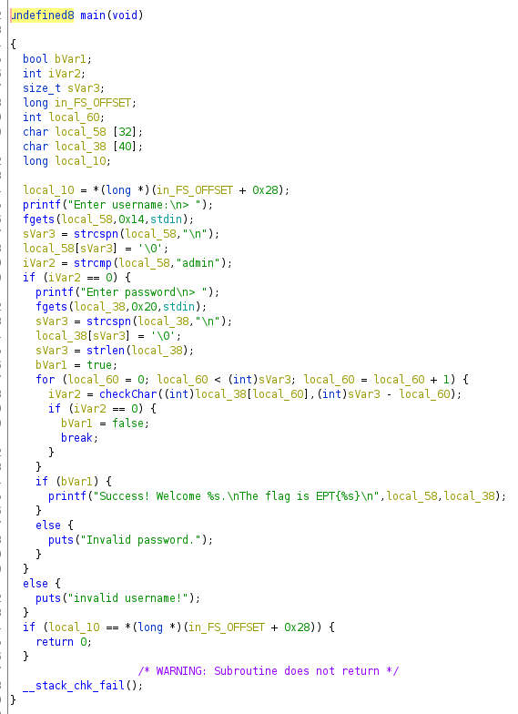

# Beginner/nop




```cs
var p = @"\/[\XZ_+YZ/\]/].+`.ZW]XWW/*+,\[Z";
var p2 = p.Select(x => (byte)(0x90 - x)).ToArray();
System.Text.Encoding.UTF8.GetString(p2.Reverse().ToArray()).Dump();
```


```
Result:
654defa998396b0eb3a34a67e16845a4
```

```bash
$ ./nop
Enter username:
> admin
Enter password
> 654defa998396b0eb3a34a67e16845a4
Success! Welcome admin.
The flag is EPT{654defa998396b0eb3a34a67e16845a}
```

## Flagg

The challenge might be a bit messed up, because the flag that was output from the program was missing a `4` at the end. But the flag is the password wrapped in the flag format.

```
EPT{654defa998396b0eb3a34a67e16845a4}
```